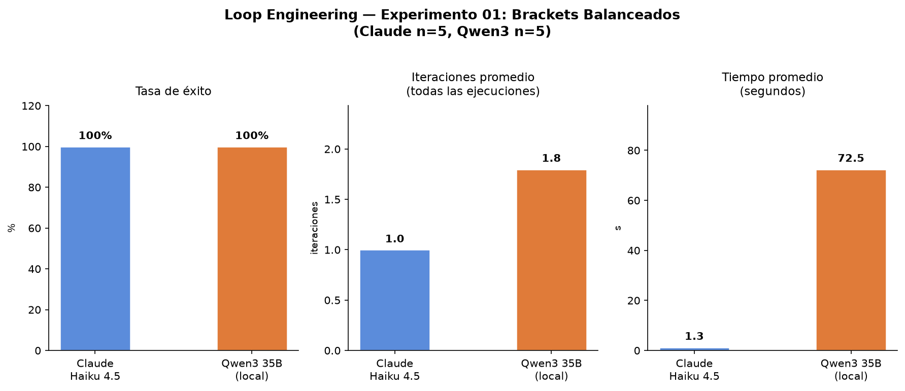

[🇬🇧 English](README.md) · [🇪🇸 Castellano](README.es.md)

---

# loop-engineering-lab


> **TL;DR** — Loop engineering means designing the *system around the agent*, not just the prompt.
> This repo is a growing lab of experiments: each one runs a real agent loop, measures it with
> deterministic tests, and shows what happens when you add proper brakes (step cap, circuit breaker,
> heartbeat, budget ceiling). Experiment 01 compares Claude Haiku, Qwen3-35B local, and
> Muse-Glimmer-30B-GGUF on a bracket-balancing task where naive solutions reliably fail.

## What is loop engineering

Loop engineering means designing the system that surrounds an agent, not just the prompt you give it.
It has two inseparable halves: the **engine** (making the agent act on something real, observe the
real result, and decide on its own when to stop) and the **brakes** (explicitly limiting how much
damage it can do while no one is watching).

An agent without an engine is a chatbot. An agent without brakes is a system that can iterate
indefinitely, spend unlimited money, or break things silently. Loop engineering means having both
halves at once, with the 6 required pieces: persistent state, automation, isolation (blast radius),
skills, connectors, and maker/checker sub-agents.

→ Full explanation in [`docs/loop-engineering-explicado.md`](docs/loop-engineering-explicado.md)

---

## Experiments

| # | Task | Models | Status |
|---|------|--------|--------|
| [01 — Brackets](experiments/01-brackets/) | `is_balanced(s)`: detect balanced brackets | Qwen3-35B local · Claude Haiku 4.5 · Muse-Glimmer-30B-GGUF | ✓ Complete |

*More experiments coming: more complex tasks, external tools via MCP, multi-agent loops.*

---

## Real results (n=5 runs per backend)

| Metric | Claude Haiku 4.5 | Qwen3-35B (local) | Muse-Glimmer-30B-GGUF (llama.cpp) |
|--------|-----------------|-------------------|-----------------------------------|
| Success rate | 100% (5/5) | 100% (5/5) | — (pending) |
| Avg iterations | 1.0 | 1.8 | — (pending) |
| Iteration range | 1–1 | 1–3 | — (pending) |
| Avg wall time | 1.3 s | 72.5 s | — (pending) |
| Avg cost | $0.00078 | $0 (local) | $0 (local) |
| Total cost (5 runs) | $0.0039 | — | — (local) |

Claude Haiku solves the task correctly on the first iteration every time.
Qwen3-35B local needs 1–3 attempts (avg 1.8) because its reasoning mode sometimes reaches a
counting-based solution before self-correcting to a stack. Both models achieve 100% success.
The time difference (1.3s vs 72.5s) reflects Qwen3's thinking overhead plus network latency to
Anthropic versus local inference.

Muse-Glimmer-30B-GGUF runs via llama.cpp server (`localhost:8080`) using the OpenAI-compatible
API endpoint. Configuration: `max_tokens=3000`, model identifier `muse-glimmer-30b`. Results
pending when the server is running.



---

## Structure

```
loop-engineering-lab/
├── docs/
│   └── loop-engineering-explicado.md   # full theory with code examples
└── experiments/
    └── 01-brackets/
        ├── loop.py                     # harness with all three backends and 4 brakes
        ├── plot.py                     # generates comparacion.png
        ├── run_comparison.sh           # runs N executions and generates the chart
        ├── skills/balanced_brackets/
        │   └── SKILL.md               # task specification (outside the code)
        └── results/
            ├── local_runs.json
            ├── claude_runs.json        # generated when running with ANTHROPIC_API_KEY
            ├── muse_runs.json          # generated when running Muse-Glimmer-30B server
            └── comparacion.png
```

---

## How to run

```bash
pip install -r requirements.txt

# Local backend only (Qwen3 via LiteLLM at localhost:4000)
cd experiments/01-brackets
python3 loop.py --backend local --runs 5

# Muse-Glimmer-30B backend (llama.cpp server at localhost:8080)
python3 loop.py --backend muse --runs 5

# All backends
cd experiments/01-brackets
export ANTHROPIC_API_KEY=sk-...
bash run_comparison.sh 5
```

---

## Harness design

The budget brake exists **literally only** in the Claude backend code path — there is no `budget`
variable in the local backend code, because there is no real cost there. This separation is
intentional: a brake that does not apply should not exist in the code path where it does not apply.

The "checker" is the Python interpreter running deterministic tests, not the model evaluating
itself. The maker/checker separation is what makes the loop converge instead of the model always
saying yes.
